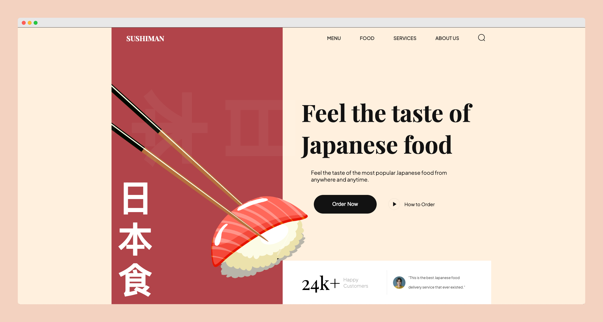

# Sushiman Website

A modern, animated landing page built with HTML, CSS, JavaScript, and Vite.
Smooth scroll animations powered by the AOS (Animate On Scroll) library.

## Features

- Fully responsive design
- Smooth scroll animations using AOS
- Fast development and optimized builds with Vite
- Clean and modular project structure

## Technologies Used

- HTML5
- CSS3
- JavaScript (ES6+)
- AOS (Animate On Scroll)
- Vite

## Live Demo

[View the live site here](https://irinaboiko.github.io/sushiman-website)

## Preview

## Getting Started

1. Install dependencies:
`npm install`

2. Run the project locally:
`npm run dev`

3. Build for production:
`npm run build`

4. Deploy to GitHub Pages:
`npm run deploy`
